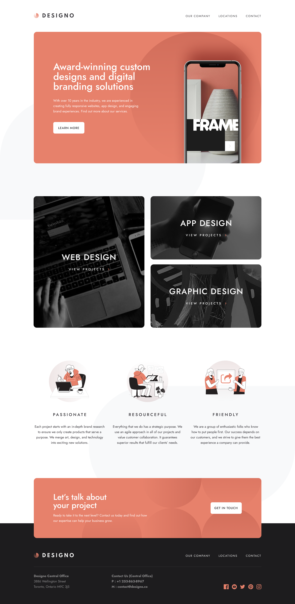

# Designo



### [Live Site](#)

## Table of contents

- [Overview](#overview)
- [Built With](#built-with)
- [Getting Started](#getting-started)
- [Contact](#contact)

## Overview

Designo is a multi-page website designed to showcase a creative design agency. It features a clean, modern design and provides information about the agency's services, portfolio, and contact details.

## Built With

- [Next.js](https://nextjs.org/) - The React Framework for the Web
- [Sass](https://sass-lang.com/) - CSS Preprocessor for styling
- [TypeScript](https://www.typescriptlang.org/) - Typed JavaScript

## Getting Started

1. **Clone the repository:**

   ```sh
   git clone https://github.com/your-username/designo.git
   ```

2. **Navigate to the project directory:**

   ```sh
   cd designo-website
   ```

3. **Install dependencies:**

   ```sh
   npm install
   # or
   yarn install
   ```

4. **Run the development server:**

   ```sh
   npm run dev
   # or
   yarn dev
   ```

5. **Open your browser:**

   Go to [http://localhost:3000](http://localhost:3000) to see the site.

